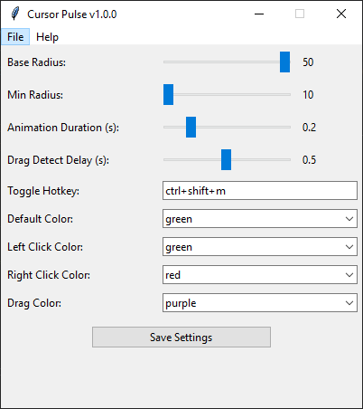

# Mouse Highlighter

A customizable mouse cursor enhancement tool that adds visual feedback for clicks and drags, perfect for tutorials, presentations, or screen recordings.

 <!-- Replace with your actual screenshot file -->

## Features

- Visual circle around mouse cursor
- Customizable colors for different click types
- Adjustable sizes and animation durations
- Toggle visibility with hotkey (Ctrl+Shift+M by default)
- System tray integration
- Configuration GUI for easy customization

## Download Pre-Compiled Version
For users without Python, download the latest standalone executable: 
[Download](./releases/download/v1.0.0/mouse_highlighter.exe) (right-click → "Save link as") 
SHA-256 Checksum: `8ac7b0f9566a6aaf4cd2410122091600e90f1752fad5f73332312269231adc6c` (verify integrity)*

## Installation

1. Clone the repository:
   git clone https://github.com/a6njaka/mouse_highlighter.git
   cd mouse-highlighter
   
2. Install required dependencies:
	pip install -r requirements.txt

## Usage
Run the application:
	python mouse_animation.py
	
Right-click the system tray icon to access menu
Use the configuration window to customize appearance
Toggle visibility with Ctrl+Shift+M

## Requirements
Python 3.6+

Windows OS (for proper transparency effects)

Packages: tkinter, pyautogui, pynput, keyboard, pystray, Pillow

## Contributing
Contributions are welcome! Please open an issue or pull request for any improvements.

## License
This project is licensed under [GPL-3.0](LICENSE).  
Key points:
- You may use, modify, and distribute this software
- **All derivative works must remain under GPL-3.0**
- You must provide source code with distributions
- No warranty is provided